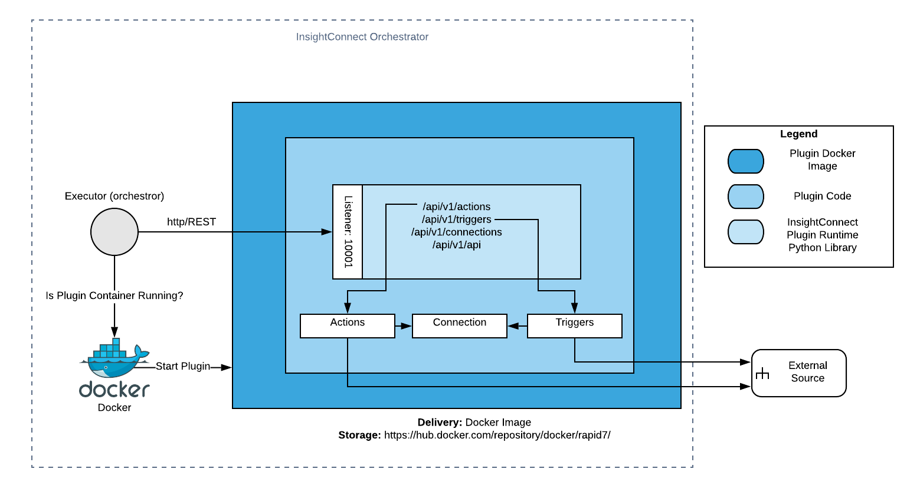

# InsightConnect Python Plugin Runtime 

[](https://github.com/psf/black)

The InsightConnect Python Plugin Runtime is used for building plugins in Python for Rapid7 InsightConnect. The project
results in the building and publishing of two components: 

* Python Plugin Runtime Library 
* Base InsightConnect Plugin Docker Images 



Docker images created during the build and deployment of this project are uploaded to the 
[Rapid7 Docker Repositories](https://hub.docker.com/orgs/rapid7/repositories).

Further [documentation](https://komand.github.io/python/start.html) for building an InsightConnect plugin is available 
to get started.

## Development of the InsightConnect Plugin Runtime

The Python Runtime codebase is built to support Python 3.8+ as of version 4.0.0. The following dependencies will need 
to be installed when developing or testing the Plugin Runtime:

- Python 3.8
- Docker
- make
- tox

### Getting Started

#### Building Python Library

To build and install the plugin runtime library locally, first create a Python virtual environment for the particular Python 
version and activate it. Then build, install, and confirm the package has been installed.
```
> python3 -m venv venv
> source venv/bin/activate
> pip install -e ./
> pip list | grep insightconnect-plugin-runtime
insightconnect-plugin-runtime 4.0.0
```

#### Building the InsightConnect Plugin Runtime Docker Images

Currently the `3-38` dockerfile is used by default when building the docker image. If you want to specify another 
dockerfile for testing purposes, such as `3-38-slim`, you can pass it as an argument.

```
make build-image DOCKERFILE=3-38-slim
```

This will overwrite the default `3-38`, provided that it exists in the `dockerfiles` directory.

### Testing Sample Plugin
The easiest way to test changes to the runtime is by running it locally against one of the [sample plugins](./samples) 
included in the repository. Make sure a virtual environment has been activated and then pass in the sample directory 
name as a parameter:
```
> make sample=example run-sample
```

The plugin will be started in `http` mode and listening at `http:0.0.0.0:10001`:
```
[2020-02-13 23:21:13 -0500] [56567] [INFO] Starting gunicorn 19.7.1
[2020-02-13 23:21:13 -0500] [56567] [INFO] Listening at: http://0.0.0.0:10001 (56567)
[2020-02-13 23:21:13 -0500] [56567] [INFO] Using worker: threads
[2020-02-13 23:21:13 -0500] [56571] [INFO] Booting worker with pid: 56571
```

To build, install, and run runtime changes without the use of the `run-sample` rule, the below steps can be used for 
same result:
```
> python setup.py build && python setup.py install
> cd samples/example
> python setup.py build && python setup.py install
> ./bin/icon_example http
```

### Testing Locally with Docker Runtime

In addition to testing locally with the resulting runtime and an InsightConnect plugin, it is also possible to build a 
plugin locally and test it as it would be used by the InsightConnect orchestrator.

First, build the base runtime:
```
make build-image
```

This will result in tagged Docker images that can be used in the included sample plugins. Then the plugin can be built 
and run locally:
```
> cd samples/example
> icon-plugin build image --no-pull
> docker run -it -p 10001:10001 rapid7/example:latest http
```

## Running Tests

In order to run tests, first ensure `tox` has been installed. Tox makes it easy for testing this project in isolated 
virtual environments and for specific Python versions. To install tox:
```
> pip install tox
```

Running all tests:
```
> tox
```

Running a specific test file:
```
> tox -e py38 -- tests/plugin/hello_world/tests/test_cli.py
```

## Release

To release a new version of the InsightConnect Python Plugin Runtime, the below steps must be followed:

1. Create a Pull Request with your changes to be merged into master
2. Merge changes after receiving at least one approval
3. Create a versioned tag off of release; version must follow [SemVer](https://semver.org/)
4. [Github Action](https://github.com/rapid7/komand-plugin-sdk-python/actions) will perform a matrix build and release 
based on the recently created tag for each Python version and Dockerfile in scope

## Contributions

Contributions for maintaining and enhancing the InsightConnect Python Plugin Runtime are appreciated. This project uses
[Black](https://github.com/psf/black) for code formatting and includes a pre-commit hook to auto format code as it is
contributed. Black is installed as a test dependency and the hook can be initialized by running `pre-commit install` 
after cloning this repository.

## Changelog

* 4.0.1 - Fix bug by including schema files in manifest | Fix issue uploading python library twice to PYPI
* 4.0.0 - Implement new API endpoints | 
 Implement Swagger API documentation generation | 
 End support for Python2 and PyPy | 
 Add development details to README |
 Enhancements to Makefile for local development and release | 
 Rebrand SDK to InsightConnect Python Plugin Runtime | 
 Revamp release process with use of Github Actions
* 3.3.0 - Add webserver route to allow for threading changes
* 3.2.0 - Add new ConnectionTestException/PluginException presets:
 UNKNOWN, BASE64_ENCODE, BASE64_DECODE, INVALID_JSON |
 Add an optional data parameter for formatting response output
